# RFC-0001: Universal CSRF Shield & Automated Engineering Must-Haves Guard

- **Author(s):** Damilola "Dami" Ogunleye (Principal Core Systems) & Kehinde "Kenny" Akindele (Staff Frontend)
- **Lead TPM:** Oluwafemi "Femi" Adeleke
- **Technical Reviewers:** Babatunde "Tunde" Olatunji (DevOps) & Ayomide "Ayo" Adeyemi (SRE)
- **Gatewatchers:** David (Architecture), Gbenga Adebisi (DBRE), Oladapo "Dapo" Salami & Marcus (SecOps)
- **Executive Sponsors:** Olutobi (Head of TAT), Victor (CTO & Head of BRATS), Helena (Board Rep)
- **Status:** APPROVED
- **Created Date:** 2026-10-08
- **Target Apps:** `shared-lib`, `PartyPlatform`, `FamilyPlatform`, `iDecide`, `iAccount`, `TenantScore`, `ExecMind`, `LoanEasyFinance`

---

## 1. Problem Statement & User Value (The "Why")

### Context & Motivation
Across the company's 7 applications, several user-facing forms have suffered from missing CSRF tokens. In high-concurrency transactional environments (event RSVPs, loan applications, financial balance updates), missing CSRF allows external malicious domains to execute authenticated state mutations on behalf of legitimate users without their knowledge. Relying on individual developers to manually "remember" CSRF or prepared statements during crunch time is an unviable operational anti-pattern.

### User & Commercial Impact
- **Security:** Eliminates OWASP Top 10 A01 (Broken Access Control) across all state-changing endpoints.
- **Compliance:** Satisfies GDPR Article 32 (Security of Processing) and UK FCA cyber-resilience requirements across the FinTech and Social clusters.
- **Developer Velocity:** Eliminates tedious PR rejections through instant automated pre-commit gating.

### Expected Outcome Metrics
- **0** state-changing forms deployed without cryptographic CSRF tokens.
- **100%** passing rate on `verify_engineering_must_haves.php` in CI.
- **0ms** user-perceived latency overhead (token generation and validation execute in $< 0.5\text{ms}$).

### Explicit Non-Goals
- This RFC does not alter existing session cookie lifecycles or session backend storage drivers (Redis/MySQL).
- This RFC does not mandate captcha challenges on standard authenticated user forms (reCAPTCHA/BotGuard remains focused on public auth routes).

---

## 2. Proposed Architecture & Technical Design (The "How")

### 2.1 Universal CSRF Architecture
Every state mutation request across the organization is validated through a unified two-tiered defense:
1. **Server-Side Token Generation (`LaravelHelper::csrfToken()`)**: Stored securely in `$_SESSION['_csrf_token']` with 256-bit cryptographically secure randomness (`random_bytes(32)`).
2. **Form Presentation (`@csrf` / `LaravelHelper::csrfField()`)**: Automatically injected as a hidden `<input type="hidden" name="_token" value="...">`.
3. **AJAX / Single Page Mutations**: Token surfaced in HTML meta tag `<meta name="csrf-token" content="...">` and passed via `X-CSRF-TOKEN` request header.
4. **Middleware Verification**: Centralized validation in `SecurityHandler` or framework middleware rejecting missing or mismatched tokens with HTTP `419 Page Expired` or `403 Forbidden`.

### 2.2 Sequence Flow Diagram

```mermaid
sequenceDiagram
    autonumber
    actor User as Authenticated User
    participant Browser as Browser Client
    participant App as Application Controller
    participant Security as SecurityHandler / Token Validator
    actor Attacker as Malicious Third-Party (CSRF Attempt)

    Note over Browser, App: Legitimate Submission Flow
    Browser->>App: GET /event/rsvp/edit
    App-->>Browser: HTML with <input type="hidden" name="_token" value="abc...">
    User->>Browser: Click "Submit RSVP"
    Browser->>Security: POST /event/rsvp (Payload + _token: "abc...")
    Security->>Security: hash_equals($_SESSION['_csrf_token'], $_POST['_token'])
    Security-->>App: Token Verified (Valid)
    App-->>Browser: HTTP 200 OK (RSVP Saved)

    Note over Attacker, App: Adversarial Exploit Attempt
    Attacker->>Browser: Tricked click on evil-attacker.com
    Browser->>Security: POST /event/rsvp (Session Cookies sent, but NO _token)
    Security->>Security: Token Missing / Invalid
    Security-->>Browser: HTTP 403 Forbidden (Exploit Neutralized)
```


---

## 3. Blast Radius & Cross-App Impact

- **`shared-lib`**: Contains the authoritative helpers (`LaravelHelper::csrfField()`, `Token::validate()`, and `scripts/verify_engineering_must_haves.php`).
- **Portfolio Blast Radius (7 Applications)**:
  - `PartyPlatform`: High volume of public and private RSVP forms.
  - `FamilyPlatform`: Sensitive family profile mutations and permission grants.
  - `iDecide`: Decision voting and criteria update forms.
  - `iAccount`: Financial transaction exports and account configuration.
  - `TenantScore`: Tenant application submissions and background verification requests.
  - `ExecMind`: AI prompt mutations and strategic note updates.
  - `LoanEasyFinance`: Loan application disclosures and affordability inputs.
- **Backward Compatibility**: Fully backward compatible. All existing valid tokens remain valid; only forms previously omitting tokens receive the required shield.

---

## 4. Failure Modes, Timeouts & Chaos Resilience

- **Session Expiration:** If a user remains idle on a form until the session expires, the CSRF check fails gracefully with HTTP 419 ("Your session has expired. Please refresh the page and try again") rather than an unhandled 500 error.
- **Multiple Browser Tabs:** Tokens are bound to the session, allowing users to submit across multiple tabs without token invalidation collisions.
- **Asynchronous Queue Resilience:** Background jobs processing deferred actions store pre-validated request records; background workers do not re-verify CSRF tokens once the request has passed controller ingress.

---

## 5. Security Threat Model & Exploitation Proof-of-Concept

### Adversarial PoC Attack Payload (Marcus & Dapo Review)
```bash
# Simulating an unauthorized cross-site POST submission with cookies but no CSRF token
curl -s -i -X POST https://app.example.test/profile/update \
  -H "Cookie: PHPSESSID=valid_authenticated_victim_cookie" \
  -d "email=attacker@evil.com"
```
**Expected Neutralization Assertion:**
- Response MUST return HTTP `403 Forbidden` or `419 Page Expired`.
- Database MUST remain unmodified.

---

## 6. Observability, Telemetry & Monitoring Plan (Ayo Adeyemi Review)

- **Structured Log Event:**
  ```json
  {
    "timestamp": "2026-10-08T23:15:00Z",
    "event": "csrf_validation_failed",
    "trace_id": "trc_847192",
    "ip_address": "192.168.1.1",
    "uri": "/profile/update",
    "method": "POST",
    "status": 403
  }
  ```
- **Alert Threshold:** More than 20 CSRF failures from a single IP or subnet within 5 minutes triggers an automated BotGuard IP block.

---

## 7. Rollback & Zero-Downtime Rollout Strategy (Tunde Olatunji Review)

- **Deployment Mechanism:** Atomic symlink deployment.
- **Rollback Trigger:** If false-positive CSRF errors exceed 0.2% of legitimate user traffic during the first 10 minutes post-deployment.
- **Rollback Command:** `bash release.sh --rollback`

---

## 8. Definition of Done (DoD) Sign-Off Checklist

- [x] **Gate 0 (Machine Pre-Flight):** Automated check in `scripts/verify_engineering_must_haves.php` passing with 0 errors.
- [x] **Gate 1 (Peer Review & Adversarial):** Approved by Dami Ogunleye, Kenny Akindele, Marcus, and Dapo Salami.
- [x] **Gate 2 (Documentation):** RFC-0001 published in `docs/rfcs/`.
- [x] **Gate 3 (Telemetry):** Structured logging hooks specified.
- [x] **Gate 4 (Deployment):** Pre-flight tests passing.
